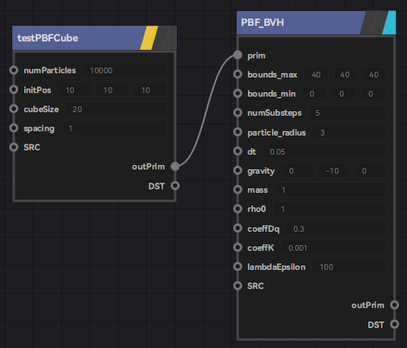
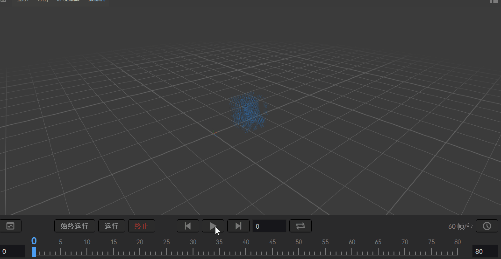

# PBF Fluid Simulation(WIP)

## Introduction

:::info
PBF is still in development and cannot be practical. This document is for development records only. The document will update dynamically.
:::

The fluid simulation in the PBD module is currently called PBF_BVH by default
PBF stands for Position Based Fluid
BVH means that we currently use BVH for neighborhood search.

It was made public in a 2013 TOG article by Miles Macklin and Matthias Muller. For details, please refer to:
* [Thesis](https://mmacklin.com/pbf_sig_preprint.pdf)
* [Youtube shows performance videos](https://www.youtube.com/watch?v=F5KuP6qEuew)

Compared to zeno's default FLIP solver, its biggest feature is that it does not require a mesh. Similar to the vellum grain in Houdini. Because it is a pure particle method, the input data is only the particle position pos, and the output data is only the particle position pos. All other data is only ancillary.

Let's start with a brief introduction to usage, and then introduce the principle.

## Usage
We first need to give the input data, which is the position of the initial particle. Then connect the `PBF_BVH` and you're good to go.
* Input: Only pos is required in prim.
* Output: There is only pos in outPrim.
* Parameters: tentative, will be adjusted.

:::info
The usage and format of the Pos data structure is almost identical to `std::vector<vec3f>`, and the two can be implicitly converted.
:::

Running effect:
Since the current parameter is ad-hoc, the scene setting is somewhat large. You need to use alt+F on the PBF_BVH to scale to the right size.

### Surface reconstruction

We resurface it.
The core node is [SmoothLiquidSDF](/).

For builders from source, the compile option needs to be turned on.

- ZENO_WITH_FastFLIP
- ZENO_WITH_zenvdb
- ZENO_WITH_ZenoFX

And in order to enable these compilation options, install Openvdb first.

Since the data format that the `SmoothLiquidSDF` node needs to input is **vdbPoint**, we first need to convert the pos data to vdbPoint format. Then use the `PrimToVDBPointDataGrid` node first. The Dx of this node can be temporarily given the particle diameter, which is 6.0

Then connect to SmoothLiquidSDF. Since this node outputs SDF, we also need to convert back to prim. That is, the SDFToPrim node.

For SmoothLiquidSDF, there is also a necessary input data for Dx. is the grid size. The smaller this value, the more detailed the reconstructed surface. We can give 1.0 first

To sum it up